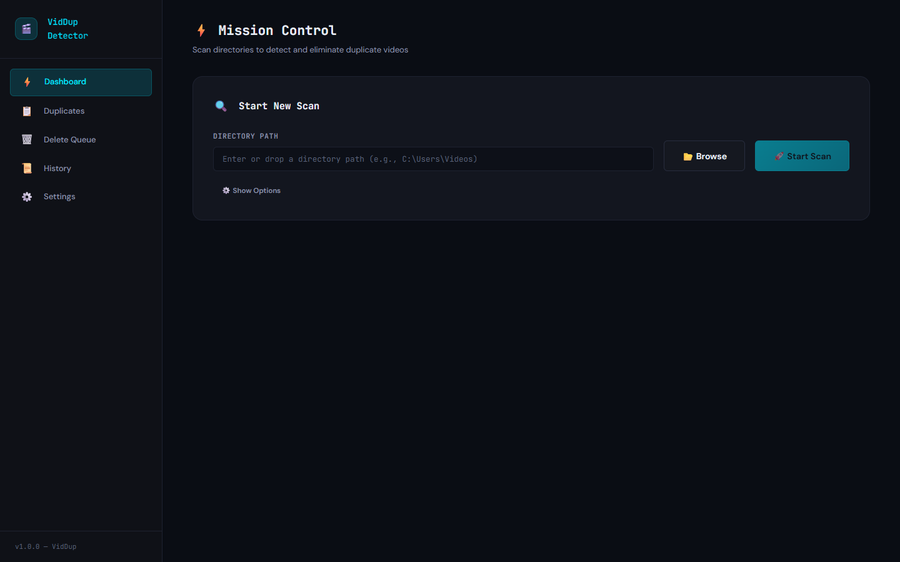

# Duplicate Video Detector



A full-stack web application that scans directories, detects duplicate or near-duplicate videos, compares their quality, and helps you clean up lower-quality copies.

Full design and operational docs live under [`docs/`](docs/) — start at [`docs/README.md`](docs/README.md). For Claude Code contributors, [`CLAUDE.md`](CLAUDE.md) is the per-session brief.

## Architecture

- **Backend**: Python + FastAPI + SQLAlchemy (SQLite) + FFmpeg
- **Frontend**: React + TypeScript + Vite
- **Real-time**: WebSocket for live scan progress

## Prerequisites

- **Python 3.10+**
- **Node.js 18+**
- **FFmpeg** (must be installed and in PATH)

### Installing FFmpeg

**Windows:**

```bash
# Using chocolatey
choco install ffmpeg

# Or download from https://ffmpeg.org/download.html
# Add ffmpeg/bin to your system PATH
```

**Mac:**

```bash
brew install ffmpeg
```

**Linux:**

```bash
sudo apt install ffmpeg
```

## Quick Start

### Option A: One-Click (Windows)

Double-click `start.bat` — starts both servers and opens the app.

- Backend: http://localhost:9000
- Frontend: http://localhost:3000

### Option B: Manual

**Backend:**

```bash
cd backend

# Create virtual environment
python -m venv venv
.\venv\Scripts\activate  # Windows
# source venv/bin/activate  # Mac/Linux

# Install dependencies
pip install -r requirements.txt

# Start the API server
uvicorn main:app --reload --host 0.0.0.0 --port 9000
```

**Frontend:**

```bash
cd frontend
npm install
npm run dev -- --port 3000
```

Open **http://localhost:3000** in your browser.

### Option C: Docker (with NVIDIA GPU)

Multi-stage build packages the React frontend into a CUDA-enabled FastAPI image; the SPA is served from the same port as the API.

```bash
# Edit docker-compose.yml first to mount your media directory:
#   - /path/to/your/videos:/media:ro

docker compose up --build
```

Open **http://localhost:9000** in your browser. Requires Docker + the [NVIDIA Container Toolkit](https://docs.nvidia.com/datacenter/cloud-native/container-toolkit/install-guide.html) on the host. The SQLite DB and generated thumbnails persist in `./data/` and `./thumbnails/` (both git-ignored).

## Features

### Duplicate Detection Pipeline

Progressive filtering with aggressive caching (full breakdown in [`docs/pipeline.md`](docs/pipeline.md)):

1. **Cache lookup** — cross-scan `file_cache` keyed by `(file_path, file_size, mtime_ns)` skips any stage whose output is already cached and fresh
2. **Byte-identical fast path** — files sharing `(size, head+tail blake2b)` are clustered and inherit their representative's hashes, skipping pHash and audio FP entirely
3. **Duration pre-filter** — groups by ±3s absolute or 5% relative tolerance, whichever is larger
4. **Perceptual hashing** — 12 key frames per video, letterbox-stripped pHash, Hamming-distance compared (FAISS-prescreened for large duration groups)
5. **Audio fingerprinting** — 60s middle-of-file RMS profile, cross-correlated as a fallback for re-encodes
6. **Quality scoring** — weighted analysis of resolution (40%), bitrate (25%), codec (15%), file size (10%), FPS (10%)

### Scan Queue

- Queue multiple directory scans — they run sequentially, one at a time
- Real-time progress via WebSocket with pause/resume/stop controls
- Per-file error log streamed live to the dashboard (frame-extract timeouts, ffprobe failures, etc.)
- Cancel queued scans before they start; delete completed scans from history one-by-one or via **Clear All** (cross-scan file cache is preserved)
- **Crash-safe**: pipeline outputs commit per-batch, so a killed/restarted server resumes from where it left off — orphaned active scans are auto-flipped to `stopped` on startup
- GPU-accelerated processing when NVIDIA CUDA is available

### Duplicate Review

- Side-by-side comparison with full metadata
- Auto-selects best quality file to keep
- Status workflow: **Pending** → **Resolved** (set after the user confirms a selection or runs auto-clean)
- Filters persist when navigating between list and comparison views

### Deletion & Cleanup

- **Deletion Queue** — batch process reviewed duplicates (permanent delete by default)
- **Auto-clean** — one-click cleanup of all lower-quality duplicates
- **History** — full deletion log with undo (restore from trash) and clear history

### Configuration

- Adjustable similarity thresholds and quality scoring weights
- Configurable detection parameters (key frames, hash threshold, duration tolerance)
- Video extensions and protected paths

## API Documentation

Once the backend is running, visit **http://localhost:9000/docs** for the interactive Swagger UI.

## Project Structure

```
├── backend/
│   ├── main.py                    # FastAPI app entry point
│   ├── config.py                  # Settings & configuration
│   ├── models/
│   │   ├── database.py            # SQLAlchemy models & DB setup
│   │   └── schemas.py             # Pydantic schemas
│   ├── services/
│   │   ├── scanner.py             # Video file discovery + head/tail content hash
│   │   ├── metadata.py            # FFprobe metadata extraction
│   │   ├── hasher.py              # Perceptual hashing (CUDA-aware)
│   │   ├── audio_fingerprint.py   # Audio fingerprint extraction
│   │   ├── comparator.py          # Duplicate detection pipeline (+ FAISS prescreen)
│   │   ├── quality_scorer.py      # Quality scoring & ranking
│   │   ├── file_manager.py        # Deletion & trash operations
│   │   ├── scan_control.py        # Pause/resume/stop signals
│   │   ├── error_log.py           # Per-scan in-memory error ring buffer
│   │   └── gpu_detector.py        # NVIDIA GPU detection
│   ├── api/
│   │   ├── scan.py               # Scan endpoints + queue logic
│   │   ├── duplicates.py         # Duplicate group endpoints
│   │   ├── actions.py            # Delete/clean/stats/history endpoints
│   │   └── websocket.py          # WebSocket connection manager
│   ├── diagnose_pair.py           # CLI: trace duplicate detection for two specific files
│   └── requirements.txt
├── frontend/
│   ├── src/
│   │   ├── App.tsx               # Root with routing & sidebar
│   │   ├── pages/                # Dashboard, DuplicatesList, ComparisonView, etc.
│   │   ├── components/           # VideoCard, ProgressTracker, ConfirmationModal, etc.
│   │   ├── hooks/                # useWebSocket, useScanProgress
│   │   ├── services/api.ts       # API client
│   │   └── types/index.ts        # TypeScript interfaces
│   └── vite.config.ts
├── docs/                          # Architecture, API, pipeline, and configuration docs
├── Dockerfile                     # Multi-stage frontend + CUDA backend build
├── docker-compose.yml             # Single-service compose with NVIDIA GPU passthrough
├── start.bat                      # Windows one-click launcher (backend + frontend)
└── README.md
```
