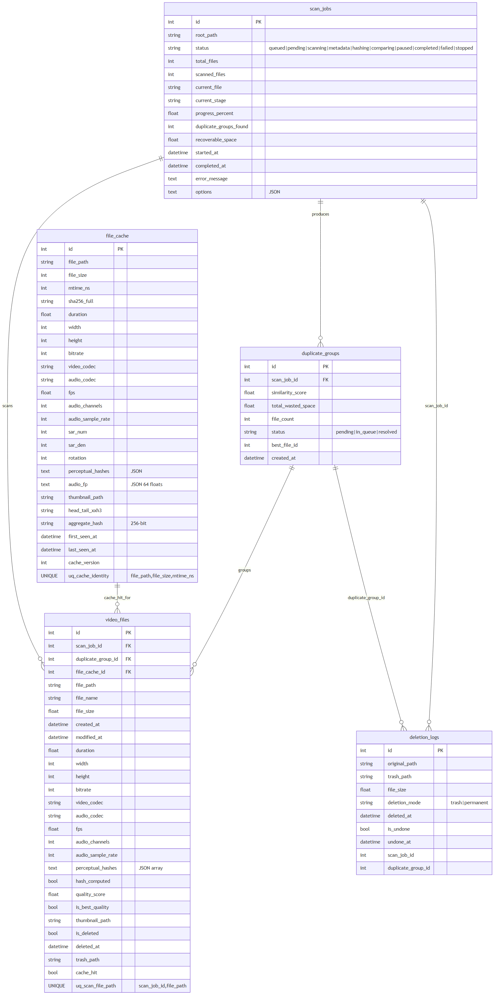
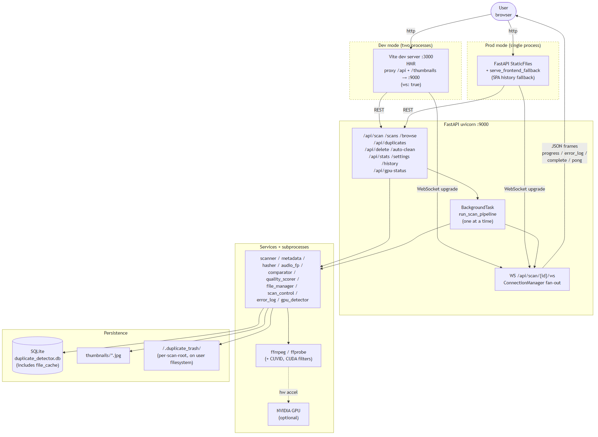
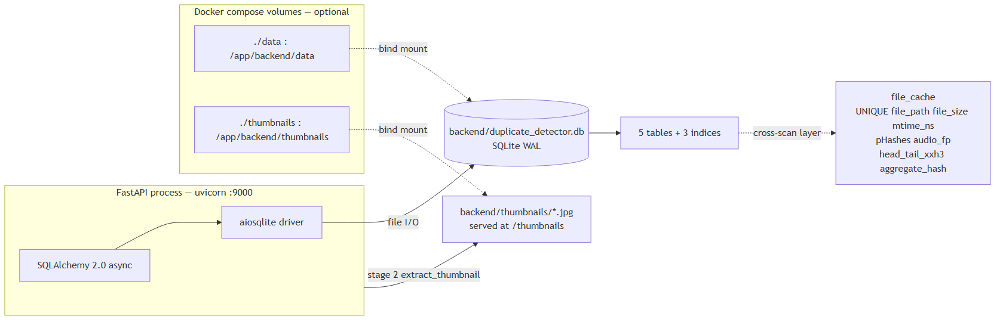
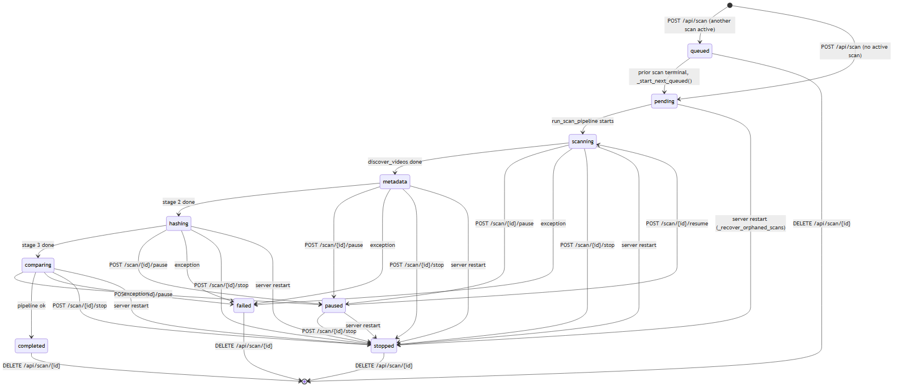
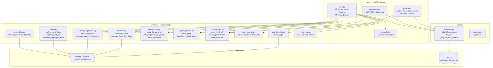
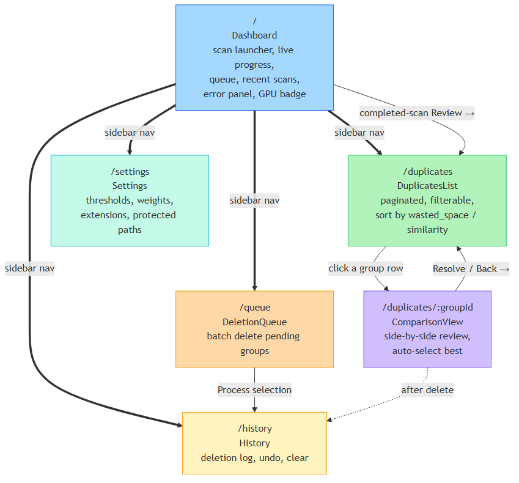
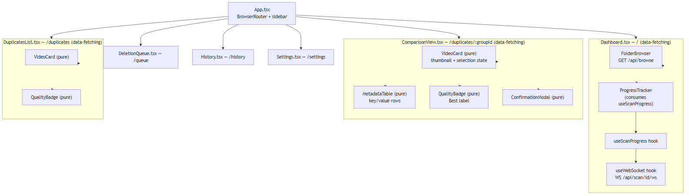
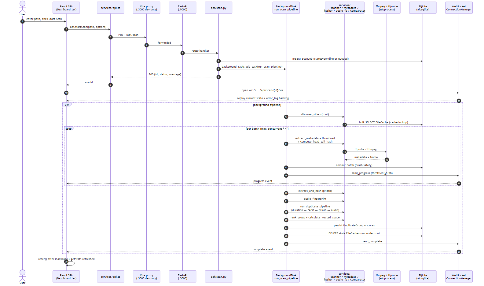

# Duplicate Video Detector


A full-stack web application that scans directories, detects duplicate or near-duplicate videos, compares their quality, and helps you clean up lower-quality copies.

Full design and operational docs live under [`docs/`](docs/) — start at [`docs/README.md`](docs/README.md). For Claude Code contributors, [`CLAUDE.md`](CLAUDE.md) is the per-session brief.

## Documentation

### Stack

| Layer          | Technology                                                          |
|----------------|---------------------------------------------------------------------|
| Database       | SQLite 3 (via `aiosqlite` async driver, WAL journaling)             |
| ORM            | SQLAlchemy 2.0 async + Pydantic v2 schemas                          |
| Backend        | Python 3.10+, FastAPI 0.104, uvicorn `[standard]`                   |
| Frontend       | React 19, Vite 7, React Router 7, TypeScript (strict)               |
| Real-time      | FastAPI native WebSocket (`/api/scan/{id}/ws`)                      |
| Auth           | None — single-user local app                                        |
| Media tooling  | FFmpeg + FFprobe (CUVID decoders + CUDA filters when GPU present)   |
| Similarity     | `imagehash` pHash · `numpy`/`scipy` RMS audio FP · `faiss-cpu` prescreen |
| Infra          | Docker multi-stage (`node:20-alpine` + `nvidia/cuda:12.2.2-runtime`), docker-compose |

### Database schema

Five tables managed by SQLAlchemy 2.0 async. `scan_jobs` owns the per-scan `video_files` and `duplicate_groups` (cascade on delete); `file_cache` is the cross-scan layer keyed by `(file_path, file_size, mtime_ns)` that lets unchanged files skip the expensive metadata / pHash / audio-FP stages on re-scans. `deletion_logs` is an append-only audit trail with undo via `trash_path`.



### Architecture overview

A two-process design in development (Vite :3000 → FastAPI :9000 proxy), a single-process design in production (FastAPI serves the built SPA from `frontend/dist`). All non-trivial work happens inside one uvicorn process — at most one scan runs at a time; additional scans queue. The frontend speaks `/api/*` over REST + `WS /api/scan/{id}/ws` for real-time progress and per-file error streaming.



### Database architecture

The database is a single SQLite file inside the FastAPI process — no separate server, no connection pool tuning, no read replica. In Docker, `./data` and `./thumbnails` are bind-mounted to survive container restarts. The cross-scan `file_cache` table lives inside the same DB; `cache_version` columns gate per-output freshness so format changes don't poison results.



### Main entity lifecycle

`ScanJob.status` is the central state machine. New scans enter `queued` if another scan is active, otherwise `pending → scanning → metadata → hashing → comparing → completed`. Pause/stop are honoured at every batch boundary by `services/scan_control.py`. On a hard process kill, `_recover_orphaned_scans()` in `main.py` flips any orphaned active state to `stopped` so the queue isn't permanently blocked.



### Backend services

Layers may only call **down**: `api/` → `services/` → `models/`. Services never import from `api`. The single exception is `api/scan.py:run_scan_pipeline`, which orchestrates the whole pipeline. FFmpeg / FFprobe are subprocesses bounded by an `asyncio.Semaphore` (12 with GPU, 8 CPU-only).



### API overview

| Method | Route                                | Description                                                          | Auth |
|--------|--------------------------------------|----------------------------------------------------------------------|------|
| POST   | `/api/scan`                          | Start a new scan (queues if another is active)                       | no   |
| GET    | `/api/scan/{id}/status`              | Current status for one scan                                          | no   |
| POST   | `/api/scan/{id}/pause`               | Pause a running scan                                                 | no   |
| POST   | `/api/scan/{id}/resume`              | Resume a paused scan                                                 | no   |
| POST   | `/api/scan/{id}/stop`                | Stop a running or paused scan                                        | no   |
| DELETE | `/api/scan/{id}`                     | Cancel a queued scan **or** delete a terminal scan from history      | no   |
| DELETE | `/api/scans`                         | Wipe every non-active scan in one shot (keeps `file_cache`)          | no   |
| GET    | `/api/scans`                         | List every scan (most recent first)                                  | no   |
| GET    | `/api/browse`                        | Filesystem directory picker (drives on Windows, `/` on Unix)         | no   |
| WS     | `/api/scan/{id}/ws`                  | Real-time progress + per-file error stream + ping/pong               | no   |
| GET    | `/api/duplicates`                    | Paginated, sortable, filterable list of duplicate groups             | no   |
| GET    | `/api/duplicates/{id}`               | One duplicate group with every video                                 | no   |
| POST   | `/api/duplicates/{id}/resolve`       | Mark a group resolved, delete the chosen file ids                    | no   |
| POST   | `/api/delete`                        | Delete a list of `video_files.id`s (trash or permanent)              | no   |
| POST   | `/api/auto-clean`                    | Auto-delete every lower-quality duplicate (with confirm preview)     | no   |
| GET    | `/api/stats`                         | Dashboard counters (videos, groups, recoverable space, …)            | no   |
| GET    | `/api/settings`                      | Current thresholds, weights, extensions, protected paths             | no   |
| PUT    | `/api/settings`                      | Update settings (in-memory; persist via `.env` / `config.py`)        | no   |
| GET    | `/api/history`                       | Paginated deletion log                                               | no   |
| POST   | `/api/history/{id}/undo`             | Restore a trashed file (rejects permanent / already-undone)          | no   |
| DELETE | `/api/history`                       | Clear every deletion log entry                                       | no   |
| GET    | `/api/gpu-status`                    | Cached GPU probe (name, VRAM, CUVID decoders, CUDA filters)          | no   |

### Frontend structure

SPA with sidebar layout (`App.tsx`). Six pages map 1:1 to user workflow: **Dashboard** (scan launcher + live progress + error panel) → **DuplicatesList** (filter/sort groups) → **ComparisonView** (side-by-side review, auto-selects best) → **DeletionQueue** → **History** → **Settings**. Three pages do all the network work; the rest of the components are pure renderers.





### Request lifecycle

The most-used call is `POST /api/scan`: handler inserts a `ScanJob` row and schedules `run_scan_pipeline` as a `BackgroundTask`, then the SPA immediately opens the WebSocket so it sees the initial state and replayed `error_log` backlog. The background pipeline emits throttled (`≥0.5%`) progress updates plus per-file `error_log` events, and commits per-batch so a hard kill loses at most one batch of work.



### Key architectural decisions

1. **Cross-scan `file_cache` keyed on `(file_path, file_size, mtime_ns)`** — same identity rsync/git use. Trades one SQL row per video for skipping the entire pipeline on unchanged re-scans; on a clean cache run, the second scan of the same library is dominated by `stat()` calls.
2. **Batched pipeline with `_pipeline_check()` between batches** — a single `gather()` over all files would be efficient but uninterruptible; batching gives O(batch_size × per-file-time) pause latency, which stays responsive even on 100k-file scans.
3. **WebSocket throttling at ≥0.5% progress advance** — `BATCH = max_concurrent * 4 ≈ 48` files per batch is ~0.4% of a 12k-file scan, so every batch-end emission survives but redundant values are suppressed.
4. **SQLite auto-migration via `_migrate_add_columns()` for nullable column adds only** — covers `file_cache.head_tail_xxh3` and `file_cache.aggregate_hash` retro-add. Heavier changes (renames, constraints, new indices) still require deleting the DB; acceptable because the data is fully regenerable.
5. **FAISS binary prescreen for duration groups of ≥16 with cached `aggregate_hash`** — turns O(n²) 12×12 pHash compares into an O(n) `range_search` over a 256-bit aggregate, verified by the existing pHash comparator. Falls back to all-pairs when FAISS is missing or the group is small.
6. **Byte-identical fast-path on `(file_size, head_tail_xxh3)`** — representatives do the expensive pHash + audio-FP work; followers inherit the outputs. Preserves transitive matching across re-encodes (a follower can still link to a transcode via the shared rep).
7. **Cache versioning (`PHASH_VERSION`, `AUDIO_FP_VERSION`)** — extraction format changes don't poison stale cache rows; rows below the current version are silently re-extracted while writers always `max(cache_version, X)` so the version is monotonically increasing.
8. **Per-batch `db.commit()` + `_recover_orphaned_scans()` on startup** — a hard kill (Ctrl-C, OOM, power loss) loses at most one batch; orphaned `ScanJob` rows flip to `stopped` so the queue isn't permanently blocked.

### What is not yet documented

- **CI/CD** — no `.github/workflows/`, `.gitlab-ci.yml`, or other pipeline config detected. To document a pipeline, add the config file and re-run the autodoc workflow; the deployment diagram already covers the runtime side.
- **Authentication flow** — intentionally absent (single-user local app). If you expose the service beyond localhost, reverse-proxy auth (basic auth at nginx / Caddy) is the documented workaround in [`docs/deployment.md`](docs/deployment.md).
- **Cache flowchart (read/write paths)** — there is no separate cache layer (Redis/Memcached) to diagram; the `file_cache` table is covered by the ER diagram and the request-lifecycle sequence above.
- **CDN / load balancer / API gateway** — the production layout is single-process (one uvicorn behind a reverse proxy at most). If you front it with a CDN or LB, extend the full-stack architecture diagram with those nodes.

## Prerequisites

- **Python 3.10+**
- **Node.js 18+**
- **FFmpeg** (must be installed and in PATH)

### Installing FFmpeg

**Windows:**

```bash
# Using chocolatey
choco install ffmpeg

# Or download from https://ffmpeg.org/download.html
# Add ffmpeg/bin to your system PATH
```

**Mac:**

```bash
brew install ffmpeg
```

**Linux:**

```bash
sudo apt install ffmpeg
```

## Quick Start

### Option A: One-Click (Windows)

Double-click `start.bat` — starts both servers and opens the app.

- Backend: http://localhost:9000
- Frontend: http://localhost:3000

### Option B: Manual

**Backend:**

```bash
cd backend

# Create virtual environment
python -m venv venv
.\venv\Scripts\activate  # Windows
# source venv/bin/activate  # Mac/Linux

# Install dependencies
pip install -r requirements.txt

# Start the API server
uvicorn main:app --reload --host 0.0.0.0 --port 9000
```

**Frontend:**

```bash
cd frontend
npm install
npm run dev -- --port 3000
```

Open **http://localhost:3000** in your browser.

### Option C: Docker (with NVIDIA GPU)

Multi-stage build packages the React frontend into a CUDA-enabled FastAPI image; the SPA is served from the same port as the API.

```bash
# Edit docker-compose.yml first to mount your media directory:
#   - /path/to/your/videos:/media:ro

docker compose up --build
```

Open **http://localhost:9000** in your browser. Requires Docker + the [NVIDIA Container Toolkit](https://docs.nvidia.com/datacenter/cloud-native/container-toolkit/install-guide.html) on the host. The SQLite DB and generated thumbnails persist in `./data/` and `./thumbnails/` (both git-ignored).

## Features

### Duplicate Detection Pipeline

Progressive filtering with aggressive caching (full breakdown in [`docs/pipeline.md`](docs/pipeline.md)):

1. **Cache lookup** — cross-scan `file_cache` keyed by `(file_path, file_size, mtime_ns)` skips any stage whose output is already cached and fresh
2. **Byte-identical fast path** — files sharing `(size, head+tail blake2b)` are clustered and inherit their representative's hashes, skipping pHash and audio FP entirely
3. **Duration pre-filter** — groups by ±3s absolute or 5% relative tolerance, whichever is larger
4. **Perceptual hashing** — 12 key frames per video, letterbox-stripped pHash, Hamming-distance compared (FAISS-prescreened for large duration groups)
5. **Audio fingerprinting** — 60s middle-of-file RMS profile, cross-correlated as a fallback for re-encodes
6. **Quality scoring** — weighted analysis of resolution (40%), bitrate (25%), codec (15%), file size (10%), FPS (10%)

### Scan Queue

- Queue multiple directory scans — they run sequentially, one at a time
- Real-time progress via WebSocket with pause/resume/stop controls
- Per-file error log streamed live to the dashboard (frame-extract timeouts, ffprobe failures, etc.)
- Cancel queued scans before they start; delete completed scans from history one-by-one or via **Clear All** (cross-scan file cache is preserved)
- **Crash-safe**: pipeline outputs commit per-batch, so a killed/restarted server resumes from where it left off — orphaned active scans are auto-flipped to `stopped` on startup
- GPU-accelerated processing when NVIDIA CUDA is available

### Duplicate Review

- Side-by-side comparison with full metadata
- Auto-selects best quality file to keep
- Status workflow: **Pending** → **Resolved** (set after the user confirms a selection or runs auto-clean)
- Filters persist when navigating between list and comparison views

### Deletion & Cleanup

- **Deletion Queue** — batch process reviewed duplicates (permanent delete by default)
- **Auto-clean** — one-click cleanup of all lower-quality duplicates
- **History** — full deletion log with undo (restore from trash) and clear history

### Configuration

- Adjustable similarity thresholds and quality scoring weights
- Configurable detection parameters (key frames, hash threshold, duration tolerance)
- Video extensions and protected paths

## API Documentation

Once the backend is running, visit **http://localhost:9000/docs** for the interactive Swagger UI.

## Project Structure

```
├── backend/
│   ├── main.py                    # FastAPI app entry point
│   ├── config.py                  # Settings & configuration
│   ├── models/
│   │   ├── database.py            # SQLAlchemy models & DB setup
│   │   └── schemas.py             # Pydantic schemas
│   ├── services/
│   │   ├── scanner.py             # Video file discovery + head/tail content hash
│   │   ├── metadata.py            # FFprobe metadata extraction
│   │   ├── hasher.py              # Perceptual hashing (CUDA-aware)
│   │   ├── audio_fingerprint.py   # Audio fingerprint extraction
│   │   ├── comparator.py          # Duplicate detection pipeline (+ FAISS prescreen)
│   │   ├── quality_scorer.py      # Quality scoring & ranking
│   │   ├── file_manager.py        # Deletion & trash operations
│   │   ├── scan_control.py        # Pause/resume/stop signals
│   │   ├── error_log.py           # Per-scan in-memory error ring buffer
│   │   └── gpu_detector.py        # NVIDIA GPU detection
│   ├── api/
│   │   ├── scan.py               # Scan endpoints + queue logic
│   │   ├── duplicates.py         # Duplicate group endpoints
│   │   ├── actions.py            # Delete/clean/stats/history endpoints
│   │   └── websocket.py          # WebSocket connection manager
│   ├── diagnose_pair.py           # CLI: trace duplicate detection for two specific files
│   └── requirements.txt
├── frontend/
│   ├── src/
│   │   ├── App.tsx               # Root with routing & sidebar
│   │   ├── pages/                # Dashboard, DuplicatesList, ComparisonView, etc.
│   │   ├── components/           # VideoCard, ProgressTracker, ConfirmationModal, etc.
│   │   ├── hooks/                # useWebSocket, useScanProgress
│   │   ├── services/api.ts       # API client
│   │   └── types/index.ts        # TypeScript interfaces
│   └── vite.config.ts
├── docs/                          # Architecture, API, pipeline, and configuration docs
├── Dockerfile                     # Multi-stage frontend + CUDA backend build
├── docker-compose.yml             # Single-service compose with NVIDIA GPU passthrough
├── start.bat                      # Windows one-click launcher (backend + frontend)
└── README.md
```
